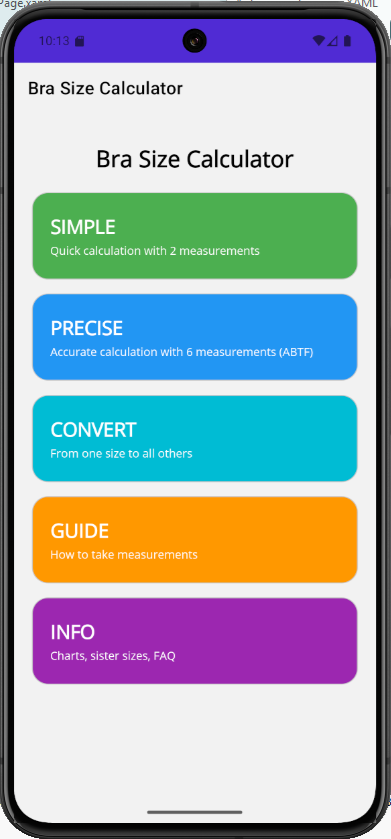
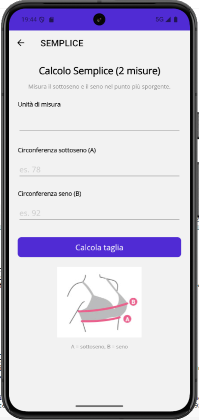
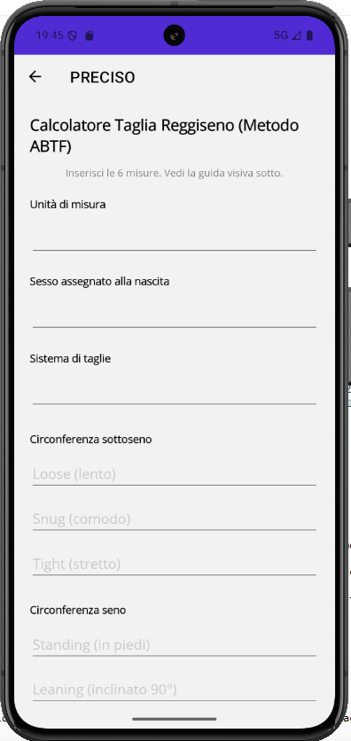
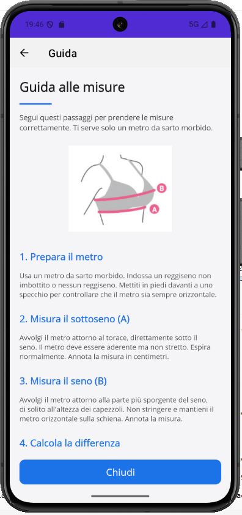
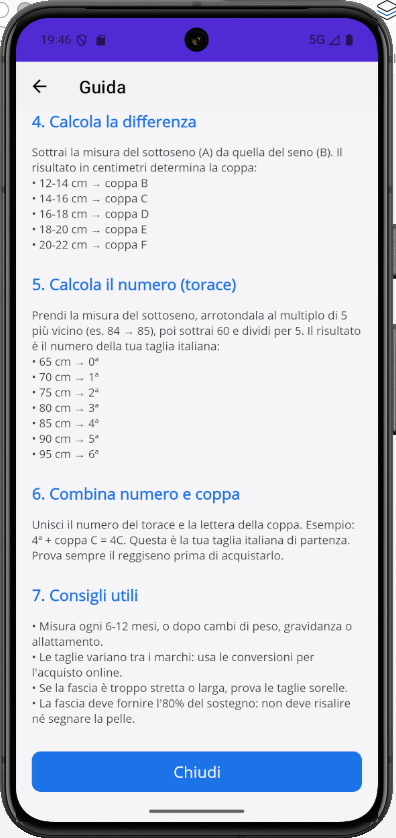
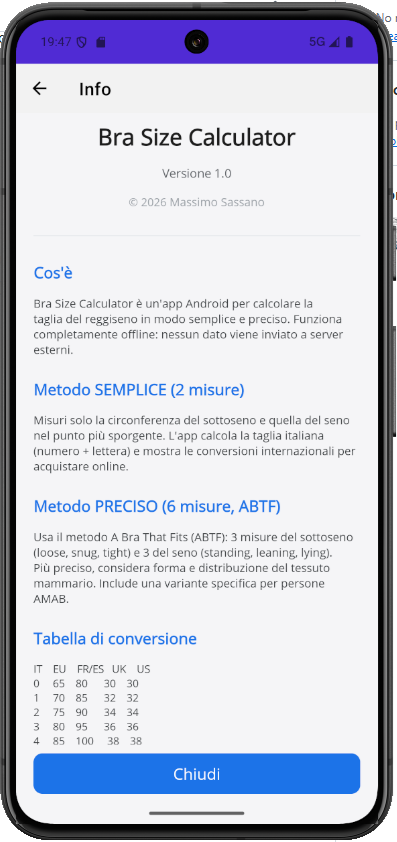

# 👙 Bra Size Calculator

App Android per calcolare in modo semplice e preciso la taglia del reggiseno, con supporto per i sistemi di misurazione italiano, europeo, britannico e americano.

---

## ✨ Funzionalità

- **Metodo SEMPLICE**: calcolo rapido con 2 misure (sottoseno + seno)
- **Metodo PRECISO**: calcolo accurato basato sul metodo **ABTF** con 6 misure
- **Convertitore di taglie** 🆕: da qualsiasi taglia a tutte le altre (es. 95B → IT, EU, FR, DE, UK, US, SMART)
- **Taglia italiana** completa: numero ordinale (0ª-12ª) + lettera coppa (A-K)
- **Conversioni internazionali**: IT, SMART, EU, FR/ES, DE, UK, US
- **Taglie sorelle**: suggerisce taglie alternative con stesso volume
- **Guida visiva** passo-passo con immagini
- **Multilingua**: italiano + inglese (automatico in base alla lingua del telefono)
- **Privacy totale**: funziona completamente offline, nessun dato inviato

---

## 📸 Screenshot

---

## 📥 Download

👉 [**Scarica l'ultima versione**](https://github.com/maxsassano/BraSizeCalculator/releases/latest)

**Requisiti:** Android 7.0 (API 24) o superiore

**Installazione:**
1. Scarica `BraSizeCalculator.apk` sul telefono
2. Impostazioni → Sicurezza → Origini sconosciute (attiva)
3. Apri l'APK → Installa

---

## 🚀 Come si usa

L'app offre **3 strumenti principali** accessibili dalla home.

### Metodo SEMPLICE — solo 2 misure
- Circonferenza sottoseno (A)
- Circonferenza seno (B)

Ideale per un calcolo rapido e per chi ha già familiarità con le proprie misure.

### Metodo PRECISO — 6 misure ABTF
- Sottoseno: loose (lento), snug (comodo), tight (stretto)
- Seno: standing (in piedi), leaning (inclinato 90°), lying (sdraiato)

Usa il metodo **A Bra That Fits (ABTF)** con variante specifica per persone AMAB. Più preciso perché tiene conto della forma e della distribuzione del tessuto mammario.

### 🆕 Convertitore di taglie
Inserisci la tua taglia attuale (es. `95B`, `5B`, `40B`) e scegli il sistema di partenza. L'app mostra immediatamente la conversione in **tutti i sistemi**:
- 🇮🇹 Italia (IT)
- 🇪🇺 Europa (EU)
- 🇫🇷 Francia/Spagna (FR)
- 🇩🇪 Germania (DE)
- 🇬🇧 Regno Unito (UK)
- 🇺🇸 Stati Uniti (US)
- 📏 Sistema SMART

Perfetto per acquisti online su Amazon, Zalando o siti internazionali.

### Guida e Info
- **GUIDA**: istruzioni passo-passo con immagini (A = sottoseno, B = seno)
- **INFO**: tabelle di conversione, sistema SMART, taglie sorelle e FAQ

---

## 📊 Tabelle di conversione

**Fascia (sottoseno)**

| IT | SMART | EU | FR/ES | DE | UK | US |
|----|----|----|----|----|----|----|
| 0 | 1 | 65 | 80 | 65 | 30 | 30 |
| 1 | 1 | 70 | 85 | 70 | 32 | 32 |
| 2 | 1 | 75 | 90 | 75 | 34 | 34 |
| 3 | 2 | 80 | 95 | 80 | 36 | 36 |
| 4 | 3 | 85 | 100 | 85 | 38 | 38 |
| 5 | 4 | 90 | 105 | 90 | 40 | 40 |
| 6 | 4 | 95 | 110 | 95 | 42 | 42 |
| 7 | 5 | 100 | 115 | 100 | 44 | 44 |
| 8 | 5 | 105 | 120 | 105 | 46 | 46 |

**Coppa**

| IT | EU | FR | DE | UK | US |
|----|----|----|----|----|----|
| A | A | A | A | A | A |
| B | B | B | B | B | B |
| C | C | C | C | C | C |
| D | D | D | D | D | D |
| E | E | E | E | DD | DD/E |
| F | F | F | F | E | DDD/F |
| G | G | G | G | F | G |
| H | H | H | H | FF | H |

---

## 🔒 Privacy

- ✅ Nessuna registrazione richiesta
- ✅ Nessun dato personale raccolto
- ✅ Nessuna connessione internet
- ✅ Tutti i calcoli avvengono sul tuo telefono

---

## 📋 Changelog

### v1.1 — 7 ottobre 2026
- ✨ **Convertitore di taglie**: da qualsiasi sistema a tutti gli altri
- ✨ **Sistema SMART** aggiunto a tutte le conversioni
- ✨ **Fix localizzazione**: il popup dei Picker ora segue la lingua del telefono
- ✨ **Fix icona**: ridimensionamento corretto su tutti i launcher Android
- ✨ **Miglioramenti UI**: emoji bandiera per ogni paese nelle conversioni
- 🐛 Fix `DisplayAlert` → `DisplayAlertAsync` (non più obsoleto)

### v1.0 — 6 ottobre 2026
- ✨ Prima release pubblica
- ✨ Doppio metodo: Semplice (2 misure) + Preciso (6 misure ABTF)
- ✨ Calcolo taglia italiana completa
- ✨ Conversioni internazionali (IT, EU, FR, DE, UK, US)
- ✨ Taglie sorelle
- ✨ Guida visiva interattiva
- ✨ Multilingua IT/EN
- ✨ Privacy garantita (offline)

---

## 📄 Licenza

MIT — vedi [LICENSE](LICENSE)

---

## ☕ Sostieni il progetto

Ogni contributo aiuta a mantenere il progetto attivo e senza pubblicità. Grazie! 🙏

---

## 🙏 Crediti

- **Metodologia**: A Bra That Fits (ABTF), community open source
- **Tabelle**: Loveable, Playtex, Beldona, Creazioni Selene
- **Sviluppo**: Massimo Sassano — .NET MAUI + C# 12

---

  <b>Bra Size Calculator v1.1</b> 
  © 2026 Massimo Sassano 
  Made with ❤️ in Italia

